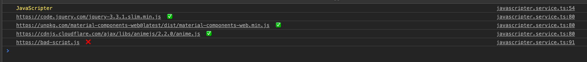

# JavaScripter

> A library for loading scripts 😄



### Usage

### Component

```ts
import { Component } from "@angular/core";
import { JavaScripter } from "javascripter";

@Component({
  selector: "app-root",
  templateUrl: "./app.component.html",
  styleUrls: ["./app.component.scss"]
})
export class AppComponent {
  title = "javascripter-demo-app";
  constructor(private javascripter: Javascripter) {
    this.service.createScripts([
      "https://cdnjs.cloudflare.com/ajax/libs/animejs/2.2.0/anime.js",
      "https://unpkg.com/material-components-web@latest/dist/material-components-web.min.js",
      "https://code.jquery.com/jquery-3.3.1.slim.min.js"
    ]);

    javascripter.onLoaded.subscribe(loaded => {
      // Do something...
    });
  }
}
```


### Module

```ts
import { BrowserModule } from '@angular/platform-browser';
import { NgModule } from '@angular/core';

import { AppComponent } from './app.component';
import { JavaScripterModule } from 'javascripter';

@NgModule({
  declarations: [
    AppComponent
  ],
  imports: [
    BrowserModule,
    JavaScripterModule.forRoot({logger: false})  // To remove logs
  ],
  providers: [],
  bootstrap: [AppComponent]
})
export class AppModule { }
```

## Was this lib useful?

If you found this lib _useful_,
please ⭐️the lib to show your appreciation!
<br>
In the spirit of open-source, share this lib with others in the community who might find it useful 😀
